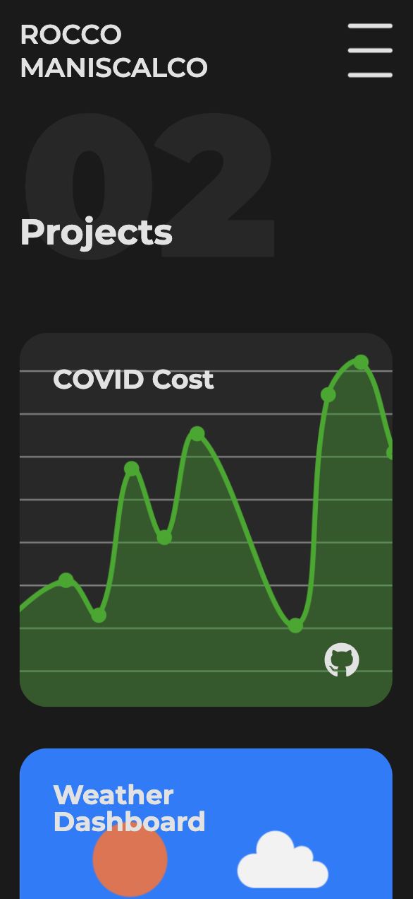
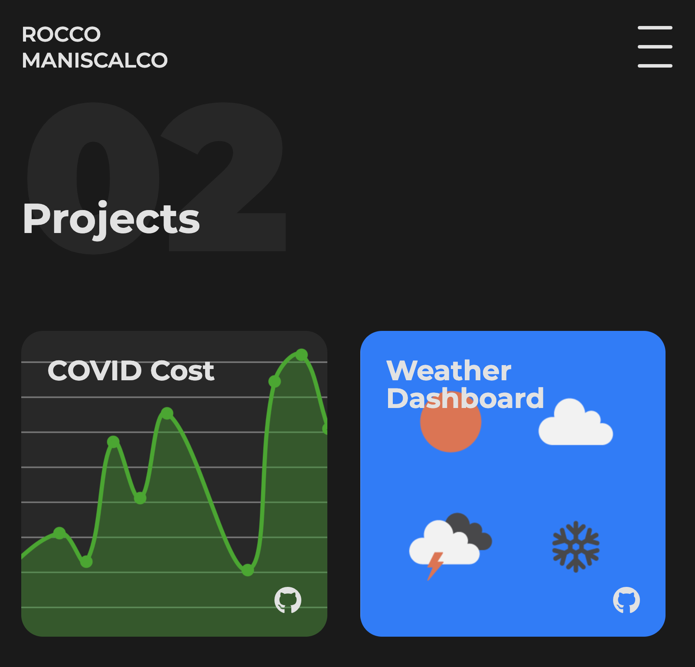

# React Portfolio

This online portfolio was designed as an archive for projects and a means to express myself as a developer. The site contains a landing page, an about, projects, and a contact section.

This is a refactor of [portfolio](https://github.com/roccomaniscalco/portfolioreact). The site has been optimized and built with [React](https://reactjs.org/). In order to be compliant with modern web best practices, the site is responsive and optimized for mobile viewports.

## Usage

Visit the online portfolio [here](https://rocco-maniscalco.herokuapp.com/).

## Installation

- Head over to the [portfolio repository](https://github.com/roccomaniscalco/react-portfolio)
- Press the green _code_ button and select method of download
- Open the repo in your text editor of choice.

## License

Licensed under the [MIT](https://opensource.org/licenses/MIT) license.